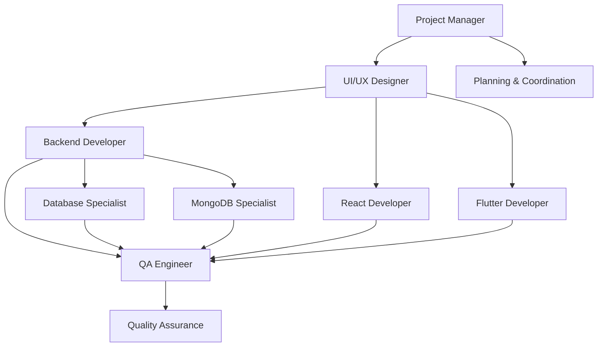

# 🤖 Agentes Especializados

Equipo completo de agentes de IA especializados para desarrollo de software moderno.

## 📋 Agentes Disponibles

| Agente                          | Especialidad                  | Archivos                         | Descripción                          |
| ------------------------------- | ----------------------------- | -------------------------------- | ------------------------------------ |
| 🏗️ **Project Manager**          | `project-manager.md`          | Planificación, roadmaps, gestión | Coordina el proyecto completo        |
| 🎨 **UI/UX Designer**           | `ui-ux-designer.md`           | Diseño, prototipado, experiencia | Diseña interfaces y experiencias     |
| ⚙️ **Backend Developer**        | `backend-developer.md`        | Supabase, Firebase, NestJS       | APIs modernas y serverless           |
| 🏛️ **NestJS Backend Specialist** | `nestjs-backend-specialist.md` | NestJS, TypeScript, Enterprise   | APIs enterprise-grade con NestJS     |
| 🗄️ **Database Specialist**      | `database-specialist.md`      | SQL, NoSQL, optimización         | Gestiona y optimiza bases de datos   |
| 🍃 **MongoDB Specialist**       | `mongodb-specialist.md`       | MongoDB, NoSQL, aggregations     | Experto en diseño y optimización MongoDB |
| 🐘 **PostgreSQL Specialist**    | `postgresql-specialist.md`    | PostgreSQL, schemas, performance | Experto en PostgreSQL avanzado       |
| ⚛️ **React Developer**          | `react-developer.md`          | React, Next.js, components       | Desarrolla interfaces web            |
| 📱 **Flutter Developer**        | `flutter-developer.md`        | Flutter, Dart, mobile apps       | Desarrolla aplicaciones móviles      |
| 🧪 **QA Engineer**              | `qa-engineer.md`              | Testing, calidad, automatización | Asegura la calidad del código        |

## 🎯 Cómo Usar los Agentes

### 1. Selección de Agente

Elige el agente según la tarea:

- **Planificación**: Project Manager
- **Diseño**: UI/UX Designer
- **Backend APIs**: Backend Developer (Supabase, Firebase, NestJS)
- **NestJS Enterprise**: NestJS Backend Specialist
- **Database**: Database Specialist (SQL, NoSQL, Prisma)
- **MongoDB**: MongoDB Specialist (Schema design, aggregations, sharding)
- **Database Generic**: Database Specialist (SQL, NoSQL, Prisma)
- **PostgreSQL Advanced**: PostgreSQL Specialist (schemas, migrations, optimization)
- **Frontend Web**: React Developer
- **Mobile**: Flutter Developer
- **Testing**: QA Engineer

### 2. Activación

```markdown
@agent-name [tarea específica]
```

### 3. Colaboración

Los agentes pueden trabajar en equipo:

- PM define los requerimientos
- UI/UX crea los diseños
- Developers implementan
- QA valida la calidad

## 🔄 Flujo de Trabajo Colaborativo



## 📚 Documentación Individual

Cada agente tiene su propia documentación detallada con:

- ✅ Responsabilidades específicas
- ✅ Herramientas y tecnologías
- ✅ Metodologías de trabajo
- ✅ Templates y ejemplos
- ✅ Criterios de calidad

## 🚀 Inicio Rápido

1. Lee la documentación del agente requerido
2. Configura las herramientas necesarias
3. Sigue las metodologías establecidas
4. Documenta el progreso
5. Colabora con otros agentes

---

_Equipo especializado para desarrollo ágil y de calidad_
