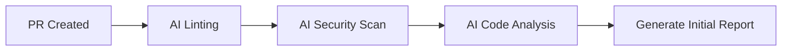

# 🤖 AI-Assisted Code Review Guidelines

Comprehensive guide for conducting effective code reviews with AI assistance.

## 📋 Table of Contents

- [Overview](#overview)
- [Review Process](#review-process)
- [AI Code Review Checklist](#ai-code-review-checklist)
- [AI Review Prompts](#ai-review-prompts)
- [Automation Integration](#automation-integration)
- [Feedback Tips](#feedback-tips)
- [Best Practices](#best-practices)

## 🎯 Overview

AI-assisted code reviews combine human expertise with AI capabilities to:
- Catch bugs and security issues faster
- Ensure consistent code quality
- Provide learning opportunities
- Reduce review time
- Maintain coding standards

### When to Use AI Review

✅ **Use AI for:**
- Initial code quality checks
- Security vulnerability scanning
- Style and formatting consistency
- Common pattern detection
- Documentation completeness

⚠️ **Human review still needed for:**
- Business logic validation
- Architecture decisions
- User experience considerations
- Domain-specific requirements
- Complex trade-offs

## 🔄 Review Process

### 1. Pre-Review (Automated)



**Actions:**
- Run automated linters
- Execute security scanners
- Generate AI code analysis
- Check test coverage
- Verify build passes

### 2. AI-Assisted Review

**Steps:**
1. Review AI-generated findings
2. Use AI to understand unfamiliar code
3. Ask AI to explain complex patterns
4. Generate suggestions for improvements
5. Validate AI recommendations

### 3. Human Review

**Focus on:**
- Business logic correctness
- Architecture alignment
- Performance implications
- User experience
- Edge cases

### 4. Feedback & Iteration

**Process:**
- Provide constructive feedback
- Use AI to suggest fixes
- Iterate on improvements
- Verify changes
- Approve when ready

## ✅ AI Code Review Checklist

### 📝 Code Quality

- [ ] **Readability**: Code is easy to understand
- [ ] **Naming**: Variables and functions have clear, descriptive names
- [ ] **Complexity**: Functions are not overly complex (low cyclomatic complexity)
- [ ] **DRY Principle**: No unnecessary code duplication
- [ ] **Comments**: Complex logic is properly commented
- [ ] **Dead Code**: No unused variables, imports, or functions
- [ ] **Magic Numbers**: No hardcoded values without explanation

### 🔒 Security

- [ ] **Input Validation**: All user inputs are validated and sanitized
- [ ] **Authentication**: Auth checks are properly implemented
- [ ] **Authorization**: Permission checks are in place
- [ ] **Secrets**: No hardcoded credentials or API keys
- [ ] **SQL Injection**: Parameterized queries used
- [ ] **XSS Prevention**: Output is properly escaped
- [ ] **CSRF Protection**: CSRF tokens implemented where needed
- [ ] **Dependencies**: No known vulnerable dependencies

### 🧪 Testing

- [ ] **Test Coverage**: New code has adequate test coverage (>80%)
- [ ] **Test Quality**: Tests are meaningful and test actual behavior
- [ ] **Edge Cases**: Edge cases and error scenarios are tested
- [ ] **Integration Tests**: Integration points are tested
- [ ] **Test Data**: No sensitive data in tests
- [ ] **Mocking**: External dependencies are properly mocked

### ⚡ Performance

- [ ] **Database Queries**: Optimized and indexed
- [ ] **N+1 Queries**: No N+1 query problems
- [ ] **Caching**: Appropriate caching strategies used
- [ ] **Memory**: No potential memory leaks
- [ ] **Async Operations**: Async code properly implemented
- [ ] **Large Files**: Large data handled efficiently

### 🏗️ Architecture

- [ ] **Design Patterns**: Appropriate patterns used
- [ ] **Separation of Concerns**: Proper separation maintained
- [ ] **SOLID Principles**: SOLID principles followed
- [ ] **Dependencies**: Dependencies are minimal and appropriate
- [ ] **Modularity**: Code is properly modularized
- [ ] **Extensibility**: Easy to extend without modification

### 📚 Documentation

- [ ] **Code Comments**: Complex logic is documented
- [ ] **API Documentation**: APIs have clear documentation
- [ ] **README**: README updated if needed
- [ ] **CHANGELOG**: CHANGELOG updated for user-facing changes
- [ ] **Migration Guides**: Breaking changes documented
- [ ] **Examples**: Usage examples provided where helpful

### 🎨 Style & Conventions

- [ ] **Coding Standards**: Follows project coding standards
- [ ] **Linter**: Passes linter without warnings
- [ ] **Formatter**: Code is properly formatted
- [ ] **Imports**: Imports are organized and clean
- [ ] **File Structure**: Files are in correct locations
- [ ] **Naming Conventions**: Follows project naming conventions

## 💬 AI Review Prompts

### General Code Review

```
Review this code for:
- Code quality and best practices
- Potential bugs or edge cases
- Security vulnerabilities
- Performance issues
- Maintainability concerns

Provide specific, actionable feedback with examples.

[CODE]
```

### Security-Focused Review

```
Perform a security review of this code:
- Authentication and authorization issues
- Input validation vulnerabilities
- SQL injection risks
- XSS vulnerabilities
- Exposed secrets or credentials
- CSRF protection
- Rate limiting needs

For each issue found, provide:
1. Severity level (Critical/High/Medium/Low)
2. Specific location in code
3. Description of the risk
4. Recommended fix with code example

[CODE]
```

### Performance Review

```
Analyze this code for performance issues:
- Time complexity (Big O)
- Space complexity
- Database query optimization
- Caching opportunities
- N+1 query problems
- Memory leaks
- Unnecessary computations

Provide specific optimizations with code examples.

[CODE]
```

### Architecture Review

```
Review the architecture and design of this code:
- Design pattern appropriateness
- SOLID principles adherence
- Separation of concerns
- Code organization
- Dependency management
- Scalability considerations

Suggest improvements with reasoning.

[CODE]
```

### Test Coverage Review

```
Analyze the test coverage for this code:
- Are all main paths tested?
- Are edge cases covered?
- Are error scenarios tested?
- Are tests meaningful and not just for coverage?
- Are integration points tested?
- Suggest additional test cases needed

[CODE]
[TESTS]
```

### Documentation Review

```
Review the documentation for this code:
- Is the code self-documenting?
- Are complex sections explained?
- Is API documentation complete?
- Are examples provided?
- Is README updated?
- Are breaking changes documented?

Suggest documentation improvements.

[CODE]
```

### Refactoring Suggestions

```
Suggest refactoring improvements for this code:
- Reduce complexity
- Improve readability
- Eliminate duplication
- Better naming
- Improved structure
- Modern best practices

For each suggestion:
1. Explain why it's better
2. Show before/after code
3. Note any trade-offs

[CODE]
```

### Code Comparison

```
Compare these two implementations:

Implementation A:
[CODE_A]

Implementation B:
[CODE_B]

Compare on:
- Readability
- Performance
- Maintainability
- Security
- Test coverage
- Edge case handling

Recommend which is better and why.
```

## 🔧 Automation Integration

### GitHub Actions Workflow

Create `.github/workflows/ai-code-review.yml`:

```yaml
name: AI Code Review

on:
  pull_request:
    types: [opened, synchronize, reopened]

permissions:
  contents: read
  pull-requests: write

jobs:
  ai-review:
    name: AI-Assisted Code Review
    runs-on: ubuntu-latest
    
    steps:
      - name: Checkout code
        uses: actions/checkout@v4
        with:
          fetch-depth: 0
      
      - name: Get changed files
        id: changed-files
        uses: tj-actions/changed-files@v40
        with:
          files: |
            **/*.js
            **/*.ts
            **/*.jsx
            **/*.tsx
            **/*.py
            **/*.go
            **/*.java
      
      - name: AI Code Quality Check
        if: steps.changed-files.outputs.any_changed == 'true'
        run: |
          echo "Running AI code quality analysis..."
          # Add your AI analysis tool here
          # Example: codegpt review or similar
      
      - name: Security Scan
        uses: github/codeql-action/analyze@v3
      
      - name: Dependency Check
        run: |
          npm audit --audit-level=moderate || true
      
      - name: Comment PR with findings
        uses: actions/github-script@v7
        with:
          script: |
            github.rest.issues.createComment({
              issue_number: context.issue.number,
              owner: context.repo.owner,
              repo: context.repo.repo,
              body: '## 🤖 AI Code Review\n\nAutomated review completed. Please check the action logs for details.'
            })
```

### Pre-commit Hooks

Add to `.pre-commit-config.yaml`:

```yaml
repos:
  - repo: local
    hooks:
      - id: ai-code-check
        name: AI Code Quality Check
        entry: ./scripts/ai-code-check.sh
        language: script
        pass_filenames: true
        types: [javascript, typescript, python]
```

### CI/CD Integration

Add to existing CI pipeline:

```yaml
  code-review:
    name: AI Code Review
    runs-on: ubuntu-latest
    steps:
      - uses: actions/checkout@v4
      
      - name: Setup Node.js
        uses: actions/setup-node@v4
        with:
          node-version: '18'
      
      - name: Install dependencies
        run: npm ci
      
      - name: Run linter
        run: npm run lint
      
      - name: Run security audit
        run: npm audit --audit-level=high
      
      - name: Check code complexity
        run: npx eslint --ext .js,.ts --max-warnings 0 src/
      
      - name: Generate coverage report
        run: npm test -- --coverage
      
      - name: Upload coverage
        uses: codecov/codecov-action@v3
```

## 💡 Feedback Tips

### Giving Effective Feedback

#### ✅ DO:

**Be Specific**
```
❌ "This function is bad"
✅ "This function has O(n²) complexity. Consider using a Map for O(n) lookup instead."
```

**Provide Examples**
```
❌ "Use better error handling"
✅ "Add try-catch with specific error types:
try {
  await processData(data);
} catch (error) {
  if (error instanceof ValidationError) {
    return res.status(400).json({ error: error.message });
  }
  throw error;
}
```

**Explain Why**
```
✅ "Extract this into a separate function because:
1. It's used in 3 places (DRY principle)
2. It makes testing easier
3. It improves readability"
```

**Ask Questions**
```
✅ "Could we use the existing `validateUser()` function instead of reimplementing validation here?"
✅ "What happens if the API returns a 500 error? Should we retry?"
```

**Praise Good Code**
```
✅ "Great use of TypeScript discriminated unions here - makes the code type-safe and self-documenting!"
✅ "Nice comprehensive test coverage on edge cases!"
```

#### ❌ DON'T:

**Be Vague**
```
❌ "This needs work"
❌ "Not good"
❌ "Change this"
```

**Be Dismissive**
```
❌ "This is obviously wrong"
❌ "Everyone knows you shouldn't do this"
❌ "This is terrible code"
```

**Nitpick Style (if auto-formatted)**
```
❌ "Add a space here"
❌ "Use single quotes instead of double"
(These should be enforced by linters/formatters)
```

**Make it Personal**
```
❌ "You don't understand async/await"
✅ "This await is inside a loop, which runs sequentially. Consider Promise.all() for parallel execution."
```

### Receiving Feedback

#### ✅ DO:

- **Ask for Clarification**: "Could you explain more about the security concern?"
- **Discuss Trade-offs**: "I chose this approach because X, but I see your point about Y"
- **Accept Suggestions**: "Good catch! I'll update this"
- **Learn from It**: Take notes on recurring feedback

#### ❌ DON'T:

- **Take it Personally**: Feedback is about code, not you
- **Be Defensive**: Explain reasoning, but be open to change
- **Ignore Feedback**: Address or discuss each point
- **Argue Endlessly**: If stuck, involve a third reviewer

### AI-Generated Feedback Template

```markdown
## 🤖 AI Review Findings

### 🔴 Critical Issues
- [Issue with severity explanation and fix]

### 🟡 Improvements Suggested
- [Improvement with reasoning and example]

### 🟢 Positive Observations
- [What's done well]

### 💡 Recommendations
- [Additional suggestions for enhancement]

### 📚 Learning Resources
- [Relevant documentation or articles]
```

## 🎯 Best Practices

### 1. Balance AI and Human Review

```
AI Review: ✓ Quick, consistent, catches common issues
Human Review: ✓ Business logic, architecture, UX
Best Approach: ✓ Combine both for comprehensive review
```

### 2. Use AI for Learning

```
Prompt: "Explain why this code pattern is recommended over alternative X"
Prompt: "What are the security implications of this approach?"
Prompt: "Show me best practices for implementing this feature"
```

### 3. Iterate with AI

```
1. Get initial AI review
2. Make changes
3. Ask AI to review changes
4. Verify improvements
5. Get human approval
```

### 4. Keep Context in AI Prompts

```
Good Prompt:
"This is a Node.js Express API using TypeScript and PostgreSQL.
Review this authentication middleware for:
- JWT validation
- Error handling
- Performance

[CODE]"
```

### 5. Document AI Findings

```
# In PR description:
## AI Review Summary
- ✅ No security vulnerabilities found
- ⚠️ 2 performance improvements suggested
- 📝 Test coverage: 87% (target: 80%)
```

### 6. Automate Repetitive Checks

Let AI handle:
- Code formatting
- Import organization
- Simple refactoring
- Test generation
- Documentation generation

Keep humans for:
- Business logic review
- Architecture decisions
- Complex trade-offs
- User experience

### 7. Track AI Review Effectiveness

Monitor:
- False positive rate
- Time saved
- Bugs caught early
- Developer satisfaction
- Code quality trends

## 📊 Metrics to Track

### Review Quality
- **Time to Review**: Average time per PR
- **Iteration Count**: Number of review rounds
- **Bug Detection Rate**: Issues found in review vs production
- **Coverage Delta**: Test coverage change per PR

### AI Effectiveness
- **Auto-fix Rate**: % of issues fixed automatically
- **Accuracy**: True positives vs false positives
- **Time Savings**: Manual review time saved
- **Developer Adoption**: % of devs using AI assist

## 🔗 Related Resources

- [Code Review Checklist](../coding-guidelines/code-review-checklist.md)
- [AI Workflow](./ai-workflow.md)
- [Prompting Best Practices](./prompting-best-practices.md)
- [CI/CD Guide](../../tools/devops/cicd-guide.md)
- [Security Checklist](../../tools/security/security-checklist.md)

## 🚀 Quick Start

1. **For Reviewers**:
   - Use the [AI Code Review Checklist](#ai-code-review-checklist)
   - Apply [AI Review Prompts](#ai-review-prompts)
   - Follow [Feedback Tips](#feedback-tips)

2. **For Authors**:
   - Run automated checks before submitting
   - Use AI to self-review
   - Address AI findings proactively

3. **For Teams**:
   - Set up [Automation Integration](#automation-integration)
   - Define review standards
   - Track metrics

---

**Last Updated**: 2025-11-13
**Version**: 1.0.0

_Empowering better code reviews through AI collaboration_ 🤖✨
