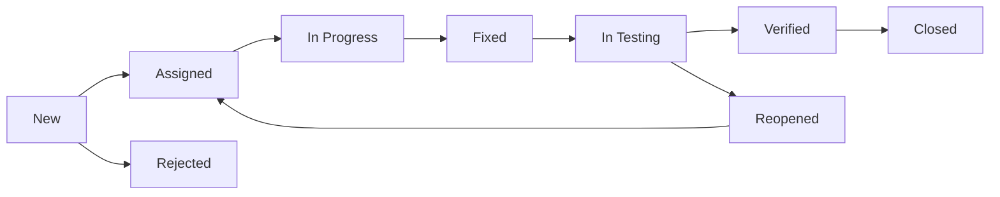

# 📝 QA Best Practices

Mejores prácticas de QA (Quality Assurance) para asegurar la excelencia del software.

## 🎯 Overview

Esta guía establece las mejores prácticas de QA que el equipo debe seguir para mantener altos estándares de calidad.

## 📋 Table of Contents

- [Quality Culture](#quality-culture)
- [Testing Strategy](#testing-strategy)
- [Bug Management](#bug-management)
- [Code Review](#code-review)
- [Documentation](#documentation)
- [Automation](#automation)
- [Metrics & Reporting](#metrics--reporting)

## 🌟 Quality Culture

### Shift-Left Testing

```markdown
## Principio: "Test Early, Test Often"

❌ Antiguo modelo (Waterfall):
Design → Development → Testing → Deployment

✅ Modelo moderno (Shift-Left):
Design ─┬→ Development ─┬→ Deployment
        │                │
        └→ Testing ←─────┘
```

### Quality Ownership

```markdown
## Todos son responsables de la calidad

- **Developers**: Escriben tests unitarios, realizan code review
- **QA Specialists**: Diseñan estrategias, automatizan tests
- **Product Owners**: Definen acceptance criteria claros
- **DevOps**: Mantienen CI/CD pipeline robusto
```

### Definition of Done

```markdown
Una feature está "Done" cuando:

- [ ] Código implementado y revisado
- [ ] Unit tests escritos y pasando (85%+ coverage)
- [ ] Integration tests implementados
- [ ] E2E tests para flujos críticos
- [ ] Documentación actualizada
- [ ] Code review aprobado
- [ ] QA validation completa
- [ ] Performance requirements met
- [ ] Security scan passed
- [ ] Accessibility validated
- [ ] Deployed to staging
- [ ] Product Owner acceptance
```

## 🎯 Testing Strategy

### Risk-Based Testing

```markdown
## Priorización por riesgo

### Alto Riesgo (Máxima cobertura)
- Autenticación y autorización
- Procesamiento de pagos
- Manejo de datos sensibles
- Lógica de negocio crítica
- Integración con servicios externos

### Medio Riesgo (Cobertura estándar)
- Features principales
- Formularios y validaciones
- Navegación y flujos
- Reportes y analytics

### Bajo Riesgo (Cobertura básica)
- Features secundarias
- UI/UX cosmético
- Configuraciones admin
- Funcionalidad legacy estable
```

### Test Case Design

```markdown
## Estructura de Test Case

### TC-001: User Login - Happy Path

**Preconditions:**
- User exists in database
- User is not logged in

**Steps:**
1. Navigate to login page
2. Enter valid email: "user@example.com"
3. Enter valid password: "ValidPass123!"
4. Click "Login" button

**Expected Results:**
- User is redirected to dashboard
- Welcome message displays user name
- Session token is created
- Last login timestamp updated

**Priority:** P1 (Critical)
**Type:** Functional
**Automation:** Yes
```

### Boundary Value Analysis

```typescript
describe('Age validation', () => {
  // Minimum boundary
  it('should reject age 0', () => {
    expect(validateAge(0)).toBe(false);
  });
  
  it('should accept age 1 (minimum valid)', () => {
    expect(validateAge(1)).toBe(true);
  });
  
  // Maximum boundary
  it('should accept age 120 (maximum valid)', () => {
    expect(validateAge(120)).toBe(true);
  });
  
  it('should reject age 121', () => {
    expect(validateAge(121)).toBe(false);
  });
  
  // Negative cases
  it('should reject negative age', () => {
    expect(validateAge(-1)).toBe(false);
  });
  
  // Invalid input
  it('should reject null', () => {
    expect(validateAge(null)).toBe(false);
  });
  
  it('should reject undefined', () => {
    expect(validateAge(undefined)).toBe(false);
  });
  
  it('should reject string', () => {
    expect(validateAge('25')).toBe(false);
  });
});
```

### Equivalence Partitioning

```typescript
describe('Discount calculation', () => {
  // Partition 1: No discount (< $50)
  it('should apply 0% discount for $49', () => {
    expect(calculateDiscount(49)).toBe(0);
  });
  
  // Partition 2: 10% discount ($50-$99)
  it('should apply 10% discount for $75', () => {
    expect(calculateDiscount(75)).toBe(7.5);
  });
  
  // Partition 3: 20% discount ($100+)
  it('should apply 20% discount for $150', () => {
    expect(calculateDiscount(150)).toBe(30);
  });
});
```

## 🐛 Bug Management

### Bug Report Template

```markdown
# Bug Report: [Short Description]

## 🔍 Bug ID
BUG-2024-001

## 📊 Severity
- [ ] P0 - Critical (System down, data loss)
- [x] P1 - High (Major feature broken)
- [ ] P2 - Medium (Feature partially works)
- [ ] P3 - Low (Minor issue, workaround exists)

## 🎯 Priority
- [x] Urgent (Fix immediately)
- [ ] High (Fix this sprint)
- [ ] Medium (Fix next sprint)
- [ ] Low (Backlog)

## 📝 Description
Clear description of the bug

## 🔄 Steps to Reproduce
1. Navigate to login page
2. Enter email: "test@example.com"
3. Enter password: "wrong_password"
4. Click "Login" button

## ✅ Expected Behavior
Error message "Invalid credentials" should appear

## ❌ Actual Behavior
Page crashes with 500 error

## 🌍 Environment
- **Browser**: Chrome 120.0
- **OS**: macOS 14.0
- **Device**: Desktop
- **Server**: Staging
- **Version**: v2.3.1

## 📸 Screenshots/Videos
[Attach screenshots or screen recording]

## 📋 Additional Context
- Error appears in console: "TypeError: Cannot read property 'id'"
- Only happens with specific email domains
- Works fine in production

## 🔗 Related Issues
- Related to #123
- Might be caused by PR #456
```

### Bug Severity Guidelines

```markdown
## P0 - Critical
- Complete system outage
- Data loss or corruption
- Security vulnerability (public)
- Payment processing broken
**SLA:** Fix within 4 hours

## P1 - High
- Major feature completely broken
- Affects majority of users
- No workaround available
- Significant performance degradation
**SLA:** Fix within 24 hours

## P2 - Medium
- Feature partially broken
- Affects some users
- Workaround available
- Minor performance issue
**SLA:** Fix within 1 week

## P3 - Low
- Cosmetic issue
- Affects very few users
- Easy workaround
- Enhancement request
**SLA:** Fix when time permits
```

### Bug Lifecycle



## 👀 Code Review

### QA Checklist for Code Review

```markdown
## Code Quality
- [ ] Code follows project style guide
- [ ] No hardcoded credentials or secrets
- [ ] Error handling implemented
- [ ] Edge cases handled
- [ ] No commented-out code
- [ ] No console.log statements

## Testing
- [ ] Unit tests included
- [ ] Tests cover happy path
- [ ] Tests cover error cases
- [ ] Tests cover edge cases
- [ ] Coverage threshold met (85%+)
- [ ] All tests passing

## Security
- [ ] Input validation implemented
- [ ] SQL injection prevented
- [ ] XSS protection in place
- [ ] Authentication/authorization checked
- [ ] Sensitive data encrypted
- [ ] Rate limiting implemented

## Performance
- [ ] No N+1 queries
- [ ] Proper indexing used
- [ ] Caching implemented where needed
- [ ] No unnecessary re-renders
- [ ] Lazy loading for heavy components
- [ ] Bundle size acceptable

## Accessibility
- [ ] Semantic HTML used
- [ ] ARIA labels where needed
- [ ] Keyboard navigation works
- [ ] Screen reader compatible
- [ ] Color contrast meets WCAG
- [ ] Focus indicators visible

## Documentation
- [ ] Code comments for complex logic
- [ ] API documentation updated
- [ ] README updated if needed
- [ ] Changelog updated
- [ ] Migration guide if breaking changes
```

## 📚 Documentation

### Test Documentation Standards

```markdown
## Test Plan Document Structure

1. **Introduction**
   - Project overview
   - Testing scope
   - Objectives

2. **Test Strategy**
   - Testing types
   - Entry/exit criteria
   - Risk assessment

3. **Test Schedule**
   - Timeline
   - Milestones
   - Resources

4. **Test Environment**
   - Hardware/software requirements
   - Test data
   - Tools

5. **Test Cases**
   - Organized by feature
   - Linked to requirements
   - Traceability matrix

6. **Defect Management**
   - Bug lifecycle
   - Severity definitions
   - Reporting process

7. **Metrics**
   - Coverage metrics
   - Defect metrics
   - Progress tracking
```

### API Documentation

```markdown
## API Endpoint Documentation

### POST /api/users

Create a new user

**Authentication Required:** Yes (Admin)

**Request Body:**
```json
{
  "email": "user@example.com",
  "password": "SecurePass123!",
  "firstName": "John",
  "lastName": "Doe",
  "role": "user"
}
```

**Success Response (201):**
```json
{
  "success": true,
  "data": {
    "id": "uuid",
    "email": "user@example.com",
    "firstName": "John",
    "lastName": "Doe",
    "role": "user",
    "createdAt": "2024-01-01T00:00:00Z"
  }
}
```

**Error Responses:**
- 400: Validation errors
- 401: Not authenticated
- 403: Insufficient permissions
- 409: Email already exists
- 500: Server error

**Test Cases:**
- TC-001: Create user with valid data
- TC-002: Reject invalid email format
- TC-003: Reject weak password
- TC-004: Prevent duplicate email
- TC-005: Require authentication
- TC-006: Enforce admin role
```

## 🤖 Automation

### Automation Strategy

```markdown
## Automation Pyramid

### What to Automate (High Priority)
✅ Regression tests
✅ Smoke tests
✅ API tests
✅ Unit tests
✅ Critical user journeys
✅ Data-driven tests

### What NOT to Automate (Low ROI)
❌ One-time tests
❌ Frequently changing UI
❌ Exploratory testing
❌ Usability testing
❌ Ad-hoc tests
❌ Tests that are hard to maintain
```

### Automation Best Practices

```typescript
// ✅ Good: Reusable, maintainable
class LoginPage {
  async login(email: string, password: string) {
    await this.emailInput.fill(email);
    await this.passwordInput.fill(password);
    await this.loginButton.click();
  }
  
  async waitForDashboard() {
    await this.page.waitForURL('/dashboard');
  }
}

// ❌ Bad: Hardcoded, not reusable
test('login', async ({ page }) => {
  await page.fill('#email', 'user@test.com');
  await page.fill('#password', 'pass123');
  await page.click('button[type=submit]');
  await page.waitForTimeout(5000); // Bad practice
});
```

## 📊 Metrics & Reporting

### Key QA Metrics

```markdown
## Test Metrics

### Coverage Metrics
- **Code Coverage**: 87% (Target: 85%)
- **Requirement Coverage**: 95% (Target: 100%)
- **API Coverage**: 92% (Target: 90%)

### Execution Metrics
- **Test Pass Rate**: 98.5%
- **Execution Time**: 12m 35s
- **Flaky Test Rate**: 1.2%
- **Automation Rate**: 94%

### Defect Metrics
- **Defect Density**: 0.8 bugs/KLOC
- **Defect Leakage**: 2%
- **Mean Time to Detect**: 4.2 hours
- **Mean Time to Resolve**: 18 hours

### Quality Metrics
- **Customer Satisfaction**: 4.5/5
- **Production Incidents**: 2/month
- **Uptime**: 99.95%
- **Performance SLA**: 98% met
```

### Quality Dashboard

```markdown
# Quality Dashboard - Sprint 23

## 🎯 Sprint Goals
- Achieve 90% test coverage
- Zero critical bugs
- Complete E2E automation

## 📊 Progress

### Test Coverage
■■■■■■■■■□ 87% (Target: 90%)

### Test Execution
✅ Unit Tests: 892/892 passed
✅ Integration Tests: 243/245 passed
✅ E2E Tests: 110/110 passed

### Bug Status
| Priority | Open | Resolved |
|----------|------|----------|
| P0       | 0    | 2        |
| P1       | 1    | 5        |
| P2       | 7    | 12       |
| P3       | 15   | 8        |

## 🎯 Action Items
- [ ] Fix 2 failing integration tests
- [ ] Increase utils coverage to 95%
- [ ] Complete checkout E2E automation
- [ ] Address 1 high-priority bug
```

## ✅ Quality Checklist

### Pre-Release Checklist

```markdown
## Release Readiness

### Testing
- [ ] All automated tests passing
- [ ] Manual regression testing complete
- [ ] Performance testing passed
- [ ] Security scan clean
- [ ] Load testing passed
- [ ] Compatibility testing done

### Documentation
- [ ] Release notes prepared
- [ ] API documentation updated
- [ ] User guide updated
- [ ] Known issues documented
- [ ] Migration guide ready

### Quality Gates
- [ ] Code coverage > 85%
- [ ] No P0/P1 bugs open
- [ ] Performance SLA met
- [ ] Security vulnerabilities resolved
- [ ] Accessibility compliance verified

### Deployment
- [ ] Staging deployment successful
- [ ] Smoke tests passed on staging
- [ ] Database migrations tested
- [ ] Rollback plan prepared
- [ ] Monitoring configured
```

## 📚 Resources

- [ISTQB Testing Glossary](https://glossary.istqb.org/)
- [Testing Best Practices - Martin Fowler](https://martinfowler.com/testing/)
- [OWASP Testing Guide](https://owasp.org/www-project-web-security-testing-guide/)

---

_QA Best Practices - Excelencia en aseguramiento de calidad_ 📝✨
