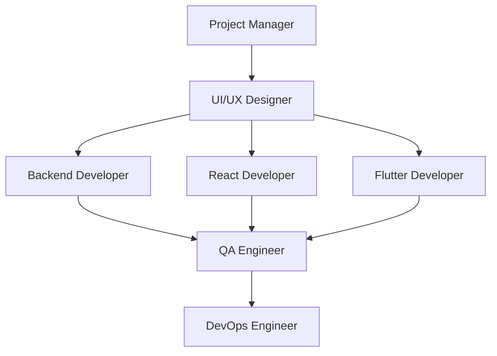

# 🔄 Flujo de Desarrollo con Agentes IA

Metodología completa para desarrollo de software usando equipos de agentes especializados de IA.

## 🎯 Principios Fundamentales

### 1. Especialización por Agente

Cada agente tiene un dominio específico de expertise:

- **Project Manager**: Planificación y coordinación
- **UI/UX Designer**: Experiencia de usuario y diseño
- **Backend Developer**: Lógica de servidor y APIs
- **Frontend Developers**: Interfaces y experiencia cliente
- **QA Engineer**: Calidad y testing
- **DevOps Engineer**: Infraestructura y deployment

### 2. Colaboración Estructurada

Los agentes trabajan en un flujo coordinado:



### 3. Documentación Como Código

Todo el conocimiento se documenta de forma estructurada:

- **Decisiones**: Por qué se tomaron ciertas decisiones
- **Procesos**: Cómo se ejecutan las tareas
- **Resultados**: Qué se logró en cada iteración

## 📋 Proceso de Desarrollo Paso a Paso

### Fase 1: Inicialización del Proyecto

#### 1.1 Project Manager Setup

```markdown
@project-manager init-project
Objetivos:

- [ ] Crear project charter
- [ ] Definir stakeholders
- [ ] Establecer objetivos SMART
- [ ] Crear backlog inicial
- [ ] Definir criterios de éxito

Documentación: docs/planning/project-charter.md
```

#### 1.2 Arquitectura y Tech Stack

```markdown
@project-manager define-architecture
Decisiones:

- [ ] Frontend: React/Flutter
- [ ] Backend: Node.js/Python/Go
- [ ] Database: MongoDB/PostgreSQL
- [ ] Hosting: AWS/GCP/Azure
- [ ] CI/CD: GitHub Actions

Documentación: docs/planning/architecture/tech-stack.md
```

### Fase 2: Diseño y Planificación

#### 2.1 Research y User Experience

```markdown
@ui-ux-designer research
Actividades:

- [ ] User research y personas
- [ ] Competitive analysis
- [ ] User journey mapping
- [ ] Information architecture
- [ ] Wireframing

Documentación: docs/design/research/
```

#### 2.2 Visual Design y Sistema

```markdown
@ui-ux-designer design-system
Entregables:

- [ ] Color palette y tipografía
- [ ] Component library
- [ ] Design tokens
- [ ] Style guide
- [ ] Prototipos interactivos

Documentación: docs/design/style-guide/
```

### Fase 3: Desarrollo Backend

#### 3.1 API Design y Database

```markdown
@backend-developer setup-infrastructure
Tareas:

- [ ] Database schema design
- [ ] API endpoints definition
- [ ] Authentication system
- [ ] Middleware setup
- [ ] Error handling

Documentación: docs/backend/api/
```

#### 3.2 Implementation y Testing

```markdown
@backend-developer implement-features
Desarrollo:

- [ ] CRUD operations
- [ ] Business logic
- [ ] Data validation
- [ ] Unit tests
- [ ] Integration tests

Documentación: docs/backend/implementation/
```

### Fase 4: Desarrollo Frontend

#### 4.1 React Development

```markdown
@react-developer setup-frontend
Setup:

- [ ] Project initialization
- [ ] Component library
- [ ] State management
- [ ] Routing setup
- [ ] API integration

Documentación: docs/frontend/react/
```

#### 4.2 Flutter Development

```markdown
@flutter-developer mobile-app
Desarrollo:

- [ ] App architecture
- [ ] Widget components
- [ ] State management
- [ ] Platform features
- [ ] Performance optimization

Documentación: docs/frontend/flutter/
```

### Fase 5: Quality Assurance

#### 5.1 Testing Strategy

```markdown
@qa-engineer test-planning
Plan de Pruebas:

- [ ] Test strategy document
- [ ] Test cases creation
- [ ] Automated testing setup
- [ ] Performance testing
- [ ] Security testing

Documentación: docs/testing/
```

#### 5.2 Execution y Validation

```markdown
@qa-engineer execute-tests
Ejecución:

- [ ] Unit test execution
- [ ] Integration testing
- [ ] E2E testing
- [ ] Performance validation
- [ ] Bug reporting

Documentación: docs/testing/reports/
```

## 🗂️ Organización de Documentación

### Estructura por Sprint

```
docs/
├── sprint-001/
│   ├── planning/
│   │   ├── sprint-goal.md
│   │   ├── user-stories.md
│   │   └── estimates.md
│   ├── design/
│   │   ├── wireframes/
│   │   └── prototypes/
│   ├── development/
│   │   ├── backend/
│   │   └── frontend/
│   ├── testing/
│   │   ├── test-plan.md
│   │   └── test-results.md
│   └── retrospective/
│       ├── what-went-well.md
│       ├── improvements.md
│       └── action-items.md
```

### Estructura por Feature

```
docs/features/
├── user-authentication/
│   ├── requirements.md
│   ├── design/
│   ├── api-spec.md
│   ├── implementation/
│   ├── testing/
│   └── deployment.md
├── user-dashboard/
└── payment-processing/
```

## 📝 Templates de Documentación

### User Story Template

```markdown
# US-{{ID}}: {{Title}}

## 📋 Description

**Como** {{user type}}
**Quiero** {{functionality}}
**Para** {{benefit/goal}}

## ✅ Acceptance Criteria

- [ ] Given {{context}}, when {{action}}, then {{outcome}}
- [ ] Given {{context}}, when {{action}}, then {{outcome}}
- [ ] Given {{context}}, when {{action}}, then {{outcome}}

## 🎨 Design Assets

- Wireframes: [Link to Figma]
- Mockups: [Link to designs]
- Prototype: [Link to interactive prototype]

## 🔧 Technical Requirements

- [ ] API endpoints needed
- [ ] Database changes required
- [ ] Third-party integrations
- [ ] Performance requirements

## 🧪 Testing Strategy

- [ ] Unit tests for business logic
- [ ] Integration tests for API
- [ ] E2E tests for user flow
- [ ] Performance tests if applicable

## 📊 Definition of Done

- [ ] Code implemented and reviewed
- [ ] Unit tests pass (>80% coverage)
- [ ] Integration tests pass
- [ ] E2E tests pass
- [ ] Documentation updated
- [ ] Security review completed
- [ ] Performance benchmarks met
- [ ] Stakeholder approval received

## 📈 Metrics Success

- {{Metric name}}: {{Target value}}
- {{Metric name}}: {{Target value}}

## 🔗 Related Items

- Blocks: {{US-ID}}
- Depends on: {{US-ID}}
- Related to: {{US-ID}}

## 📅 Timeline

- **Estimated**: {{story points}} points
- **Started**: {{date}}
- **Completed**: {{date}}

## 👥 Assignees

- **PM**: {{Project Manager}}
- **Design**: {{UI/UX Designer}}
- **Backend**: {{Backend Developer}}
- **Frontend**: {{Frontend Developer}}
- **QA**: {{QA Engineer}}

## 📝 Notes

{{Additional notes, decisions, or context}}
```

### Technical Task Template

```markdown
# TASK-{{ID}}: {{Title}}

## 🎯 Objective

{{Clear description of what needs to be accomplished}}

## 🔧 Technical Details

### Implementation Approach

{{How this will be implemented}}

### Technologies Used

- {{Tech stack items}}

### APIs/Services Involved

- {{List of APIs or services}}

### Database Changes

- [ ] Schema changes needed
- [ ] Migration required
- [ ] Data seeding needed

## 📋 Subtasks

- [ ] {{Subtask 1}}
- [ ] {{Subtask 2}}
- [ ] {{Subtask 3}}

## 🧪 Testing Checklist

- [ ] Unit tests written
- [ ] Integration tests updated
- [ ] Manual testing completed
- [ ] Performance tested

## 📚 Documentation Updates

- [ ] API documentation
- [ ] Code comments
- [ ] README updates
- [ ] Architecture diagrams

## 🔍 Code Review Checklist

- [ ] Code follows style guidelines
- [ ] No security vulnerabilities
- [ ] Performance considerations addressed
- [ ] Error handling implemented
- [ ] Logging added where appropriate

## 🚀 Deployment Notes

- [ ] Environment variables needed
- [ ] Configuration changes
- [ ] Database migrations
- [ ] Third-party service setup

## ✅ Acceptance Criteria

- [ ] {{Specific, measurable criteria}}
- [ ] {{Specific, measurable criteria}}

## 📊 Success Metrics

- {{Performance metric}}: {{Target}}
- {{Quality metric}}: {{Target}}
```

## 🤝 Coordinación Entre Agentes

### Daily Sync (Async)

```markdown
# Daily Sync - {{Date}}

## 🏗️ Project Manager

- **Yesterday**: {{Accomplished}}
- **Today**: {{Planned}}
- **Blockers**: {{Issues}}

## 🎨 UI/UX Designer

- **Yesterday**: {{Design work completed}}
- **Today**: {{Design tasks planned}}
- **Blockers**: {{Design blockers}}

## ⚙️ Backend Developer

- **Yesterday**: {{Backend progress}}
- **Today**: {{Backend goals}}
- **Blockers**: {{Technical blockers}}

## ⚛️ React Developer

- **Yesterday**: {{Frontend progress}}
- **Today**: {{Frontend goals}}
- **Blockers**: {{Frontend blockers}}

## 📱 Flutter Developer

- **Yesterday**: {{Mobile progress}}
- **Today**: {{Mobile goals}}
- **Blockers**: {{Mobile blockers}}

## 🧪 QA Engineer

- **Yesterday**: {{Testing progress}}
- **Today**: {{Testing goals}}
- **Blockers**: {{Testing blockers}}

## 🎯 Team Goals Today

- {{Shared objective 1}}
- {{Shared objective 2}}

## 🚫 Team Blockers

- {{Cross-team blocker 1}}
- {{Cross-team blocker 2}}
```

### Sprint Review Template

```markdown
# Sprint {{Number}} Review - {{Date}}

## 🎯 Sprint Goal

{{Original sprint goal}}

## 📊 Sprint Metrics

- **Planned Story Points**: {{number}}
- **Completed Story Points**: {{number}}
- **Velocity**: {{percentage}}%
- **Completed User Stories**: {{count}}
- **Bugs Found**: {{count}}
- **Bugs Fixed**: {{count}}

## ✅ Completed Work

### User Stories

- [ ] {{US-ID}}: {{Title}} - {{Agent}}
- [ ] {{US-ID}}: {{Title}} - {{Agent}}

### Technical Tasks

- [ ] {{TASK-ID}}: {{Title}} - {{Agent}}
- [ ] {{TASK-ID}}: {{Title}} - {{Agent}}

### Bug Fixes

- [ ] {{BUG-ID}}: {{Title}} - {{Agent}}

## ⏳ Incomplete Work

- {{US-ID}}: {{Title}} - {{Reason for incompletion}}
- {{TASK-ID}}: {{Title}} - {{Reason for incompletion}}

## 🎨 Design Deliverables

- {{Design asset 1}}
- {{Design asset 2}}

## 🔧 Technical Achievements

- {{Technical milestone 1}}
- {{Technical milestone 2}}

## 🧪 Quality Metrics

- **Test Coverage**: {{percentage}}%
- **Performance**: {{metrics}}
- **Security**: {{status}}
- **Accessibility**: {{score}}

## 📈 Demo Highlights

- {{Feature 1 demo}}
- {{Feature 2 demo}}

## 🤔 Retrospective Input

### What Went Well

- {{Positive aspect 1}}
- {{Positive aspect 2}}

### What Could Improve

- {{Improvement area 1}}
- {{Improvement area 2}}

### Action Items

- [ ] {{Action item 1}} - {{Owner}}
- [ ] {{Action item 2}} - {{Owner}}

## 🎯 Next Sprint Preview

- {{Upcoming priority 1}}
- {{Upcoming priority 2}}
```

## 🔄 Git Workflow con Agentes

### Branch Naming Convention

```
feature/agent-name/feature-description
├── feature/pm/user-authentication-planning
├── feature/design/login-screen-mockups
├── feature/backend/user-auth-api
├── feature/react/login-component
├── feature/flutter/login-screen
└── feature/qa/auth-testing-suite
```

### Commit Message Convention

```
[agent] type(scope): description

Examples:
[pm] docs(planning): add user authentication user stories
[design] feat(ui): create login screen wireframes
[backend] feat(auth): implement JWT authentication
[react] feat(auth): add login form component
[flutter] feat(auth): implement login screen
[qa] test(auth): add login flow E2E tests
```

### Pull Request Template

```markdown
# {{Feature Name}} - {{Agent}}

## 🎯 Purpose

{{What this PR accomplishes}}

## 🔗 Related Issues

- Closes #{{issue-number}}
- Related to #{{issue-number}}

## 🧪 Testing

- [ ] Unit tests added/updated
- [ ] Integration tests pass
- [ ] Manual testing completed
- [ ] Performance tested

## 📚 Documentation

- [ ] API documentation updated
- [ ] README updated
- [ ] Code comments added
- [ ] Architecture diagrams updated

## 🔍 Code Review Checklist

- [ ] Code follows style guidelines
- [ ] No security vulnerabilities
- [ ] Performance considerations
- [ ] Error handling
- [ ] Accessibility compliance

## 📊 Impact Assessment

### Performance

- {{Impact on performance}}

### Security

- {{Security considerations}}

### Accessibility

- {{Accessibility impact}}

## 🖼️ Screenshots/Demos

{{If applicable, add screenshots or demo links}}

## 🎯 Agent Coordination

### Coordination with Other Agents

- {{How this affects other agents' work}}

### Next Steps

- {{What other agents need to do next}}

## 📝 Deployment Notes

- [ ] Environment variables needed
- [ ] Database migrations required
- [ ] Configuration changes
- [ ] Third-party setup needed

## ✅ Definition of Done

- [ ] All acceptance criteria met
- [ ] Code reviewed and approved
- [ ] Tests passing
- [ ] Documentation complete
- [ ] Security review passed
- [ ] Performance benchmarks met
```

## 🎯 Criterios de Calidad por Fase

### Planning Phase Quality Gates

- [ ] Requirements are SMART (Specific, Measurable, Achievable, Relevant, Time-bound)
- [ ] User stories have clear acceptance criteria
- [ ] Technical architecture is documented
- [ ] Dependencies are identified
- [ ] Risks are assessed and mitigated

### Design Phase Quality Gates

- [ ] User research validates design decisions
- [ ] Designs are accessible (WCAG 2.1 AA)
- [ ] Design system is consistent
- [ ] Responsive design is planned
- [ ] Prototypes are user-tested

### Development Phase Quality Gates

- [ ] Code coverage >80%
- [ ] Performance benchmarks met
- [ ] Security scan passes
- [ ] API documentation complete
- [ ] Error handling implemented

### Testing Phase Quality Gates

- [ ] All critical paths tested
- [ ] Performance requirements met
- [ ] Security vulnerabilities addressed
- [ ] Cross-browser compatibility verified
- [ ] Mobile responsiveness validated

### Deployment Phase Quality Gates

- [ ] Staging environment matches production
- [ ] Rollback plan documented
- [ ] Monitoring and alerting configured
- [ ] Documentation updated
- [ ] Success metrics defined

---

_Workflow - Proceso estructurado para desarrollo con agentes IA_ 🔄
