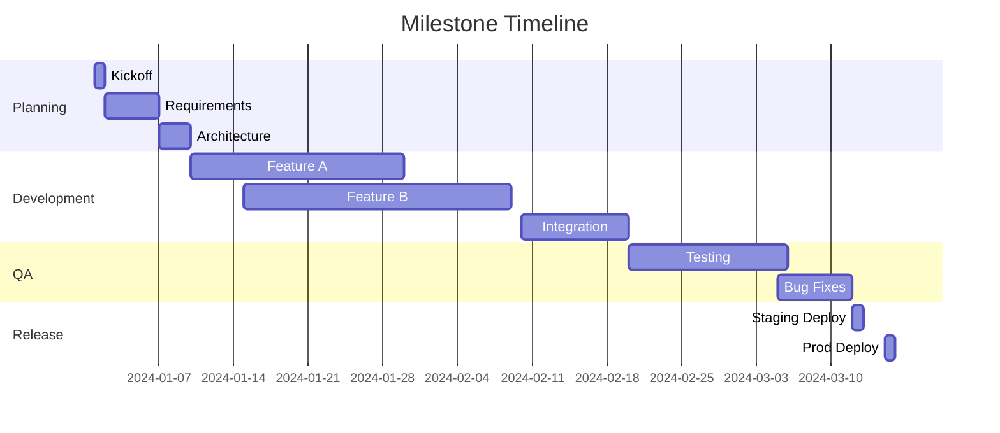
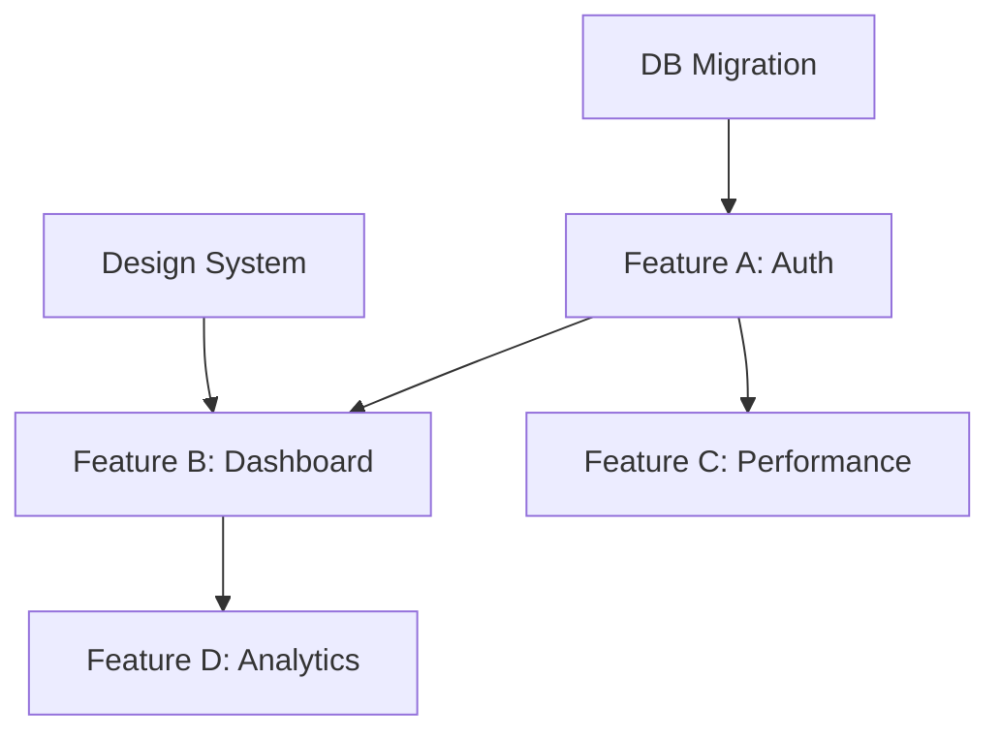

# 🎯 Feature/Milestone Mode - Planificación por Entregables

Metodología orientada a entregables específicos con fechas fijas y coordinación entre equipos.

## 📖 Descripción General

Feature/Milestone Mode es ideal para lanzamientos de productos, grandes features o proyectos con fechas de entrega fijas. Enfocado en coordinar múltiples equipos hacia objetivos específicos.

## ⚙️ Configuración Inicial

### Definir Milestone

```yaml
milestone_configuration:
  name: "v2.0 Product Launch"
  type: "Major Release"  # Major Release / Feature Release / Bug Fix Release
  target_date: "2024-03-15"
  scope:
    - Feature A
    - Feature B
    - Performance Improvements
  teams_involved:
    - Backend Team
    - React Team
    - Flutter Team
    - UI/UX Team
    - QA Team
  success_criteria:
    - All P0 features complete
    - Zero critical bugs
    - Performance benchmarks met
    - Documentation complete
```

### Estructura de Equipos

- **Release Manager** (PM Agent): Coordina el milestone completo
- **Feature Leads**: Un agent líder por cada feature importante
- **Cross-functional Teams**: Agents de diferentes especialidades
- **Stakeholders**: Product owners, executives

## 📋 Phases del Milestone

### Phase 1: Planning (10% del tiempo)

**Objetivos**:
- Definir scope completo
- Identificar dependencies
- Crear roadmap detallado
- Asignar recursos

**Milestone Charter**:

```markdown
# Milestone Charter: {{Name}}

## 🎯 Vision & Goals

### Vision Statement
{{Clear, inspiring vision for this milestone}}

### Business Goals
- **Revenue Target**: {{amount}}
- **User Growth**: {{percentage}}
- **Market Position**: {{objective}}
- **Customer Satisfaction**: {{metric}}

### Success Metrics
| Metric | Current | Target | Measurement |
|--------|---------|--------|-------------|
| DAU | {{X}} | {{Y}} | Analytics |
| NPS | {{X}} | {{Y}} | Survey |
| Performance | {{X}}ms | {{Y}}ms | APM |
| Coverage | {{X}}% | {{Y}}% | CI/CD |

## 📅 Timeline

### Key Dates
- **Kickoff**: {{date}}
- **Feature Freeze**: {{date}}
- **Code Complete**: {{date}}
- **QA Complete**: {{date}}
- **Release**: {{date}}

### Phase Breakdown


## 🎨 Features & Scope

### P0 - Must Have (Critical)
#### Feature A: User Authentication Revamp
- **Owner**: @backend-agent, @react-agent
- **Dependencies**: None
- **Risk**: Medium
- **Estimate**: 3 weeks
- **Value**: High - Required for security compliance

**User Stories**:
- [ ] US-001: OAuth 2.0 integration - 13pts
- [ ] US-002: Multi-factor authentication - 8pts
- [ ] US-003: Session management - 5pts

#### Feature B: Advanced Dashboard
- **Owner**: @react-agent, @ui-ux-agent
- **Dependencies**: Feature A (auth)
- **Risk**: Low
- **Estimate**: 4 weeks
- **Value**: High - Key differentiator

**User Stories**:
- [ ] US-010: Real-time data visualization - 13pts
- [ ] US-011: Customizable widgets - 8pts
- [ ] US-012: Export functionality - 5pts

### P1 - Should Have (Important)
#### Feature C: Performance Optimization
- **Owner**: @backend-agent
- **Dependencies**: All features
- **Risk**: High
- **Estimate**: 2 weeks
- **Value**: Medium - Competitive advantage

### P2 - Nice to Have (Optional)
#### Feature D: Advanced Analytics
- **Owner**: @backend-agent, @react-agent
- **Dependencies**: Feature B
- **Risk**: Low
- **Estimate**: 2 weeks
- **Value**: Low - Future enhancement

## 🔗 Dependencies

### External Dependencies
- [ ] Third-party OAuth provider approval - Due: Jan 15
- [ ] Design system v2.0 from UI/UX - Due: Jan 10
- [ ] Database migration approval - Due: Jan 20

### Internal Dependencies


## ⚠️ Risks & Mitigation

| Risk | Impact | Probability | Mitigation | Owner |
|------|--------|-------------|------------|-------|
| OAuth approval delayed | High | Medium | Start integration with sandbox | Backend |
| Performance targets not met | High | Low | Early benchmarking, optimization sprints | Backend |
| Design changes mid-flight | Medium | Medium | Freeze designs 2 weeks before dev | UI/UX |
| Resource unavailability | Medium | Low | Cross-train agents, buffer time | PM |

## 👥 Team & Responsibilities

### Core Team
- **Release Manager**: @pm-agent
- **Backend Lead**: @backend-agent
- **Frontend Lead**: @react-agent
- **Mobile Lead**: @flutter-agent
- **Design Lead**: @ui-ux-agent
- **QA Lead**: @qa-agent

### Stakeholders
- **Product Owner**: {{name}}
- **Engineering Director**: {{name}}
- **Key Customer**: {{name}}

## 📊 Tracking & Reporting

### Weekly Status Reports
- **Audience**: Stakeholders
- **Frequency**: Every Friday
- **Format**: Email + Dashboard link

### Daily Standups
- **Audience**: Core team
- **Frequency**: Daily
- **Duration**: 15 minutes

## ✅ Definition of Done (Milestone)

- [ ] All P0 features complete and tested
- [ ] All P1 features complete or explicitly de-scoped
- [ ] Zero P0/P1 bugs
- [ ] Performance benchmarks met
- [ ] Security review passed
- [ ] Documentation complete
- [ ] Training materials ready
- [ ] Rollback plan documented
- [ ] Stakeholder sign-off received

## 📝 Communication Plan

### Status Update Template
Weekly update sent to stakeholders every Friday at 5pm

### Escalation Path
Issue → Feature Lead → Release Manager → Director

---

**Created**: {{date}}
**Last Updated**: {{date}}
**Owner**: @pm-agent
```

### Phase 2: Development (60% del tiempo)

**Workflow por Feature**:

```markdown
# Feature Development: {{Feature Name}}

## 📋 Feature Brief

### Problem Statement
{{What problem does this solve?}}

### User Value
{{How does this benefit users?}}

### Technical Approach
{{High-level technical design}}

## 🎯 Acceptance Criteria
- [ ] Functional requirements met
- [ ] Non-functional requirements met (performance, security)
- [ ] Documentation complete
- [ ] Tests passing (>80% coverage)
- [ ] Design review approved
- [ ] Security review passed

## 📅 Timeline

### Week 1-2: Foundation
- [ ] Design finalization
- [ ] API design
- [ ] Database schema
- [ ] Component scaffolding

### Week 3-4: Core Development
- [ ] Backend implementation
- [ ] Frontend implementation
- [ ] Integration
- [ ] Unit tests

### Week 5: Polish & Testing
- [ ] Integration testing
- [ ] Performance testing
- [ ] Bug fixes
- [ ] Documentation

## 👥 Team

| Role | Agent | Commitment |
|------|-------|------------|
| Backend | @backend-agent | 100% |
| Frontend | @react-agent | 100% |
| Design | @ui-ux-agent | 50% |
| QA | @qa-agent | 50% |

## 📊 Progress Tracking

### Status: 🟢 On Track / 🟡 At Risk / 🔴 Off Track

### Metrics
- **Completion**: {{X}}%
- **Story Points**: {{Y}}/{{Z}} completed
- **Bugs**: {{count}} open
- **Days Remaining**: {{X}}

### Blockers
- [ ] {{Blocker 1}} - Owner: {{agent}} - Target: {{date}}
- [ ] {{Blocker 2}} - Owner: {{agent}} - Target: {{date}}

## 🔗 Links
- Design: {{figma link}}
- API Docs: {{link}}
- Test Plan: {{link}}
- GitHub Project: {{link}}
```

**Daily Progress Updates**:

```markdown
# Daily Update - {{date}} - {{Feature Name}}

## ✅ Completed Today
- Implemented user authentication flow
- Created login component
- Added unit tests for auth service
- Updated API documentation

## 🚧 In Progress
- Integrating OAuth provider
- Designing error handling flows

## 🔜 Next
- Complete OAuth integration
- Start on session management
- Code review on auth service

## 🚫 Blockers
- Waiting for OAuth sandbox credentials (ETA: tomorrow)

## 📊 Health
- **Status**: 🟢 On Track
- **Confidence**: 8/10
- **Risk**: None identified

**Posted by**: @backend-agent
```

### Phase 3: Integration (15% del tiempo)

**Integration Checklist**:

```markdown
# Integration Phase - {{Milestone Name}}

## 🔗 Feature Integration

### Feature A + Feature B
- [ ] API contracts validated
- [ ] Data flow tested
- [ ] UI components integrated
- [ ] E2E tests passing

### Feature B + Feature C
- [ ] Performance impact assessed
- [ ] Caching strategy implemented
- [ ] Load tests passing

## 🧪 Integration Testing

### API Integration Tests
- [ ] All endpoints tested together
- [ ] Error scenarios covered
- [ ] Authentication flows validated
- [ ] Rate limiting verified

### UI Integration Tests
- [ ] All user flows tested
- [ ] Cross-component interactions verified
- [ ] State management validated
- [ ] Responsive design checked

### System Integration Tests
- [ ] Database migrations successful
- [ ] Third-party integrations working
- [ ] Background jobs processing
- [ ] Monitoring and logging operational

## 🔍 Integration Issues

| Issue | Severity | Status | Owner | Target |
|-------|----------|--------|-------|--------|
| {{Description}} | P0 | Open | @agent | {{date}} |

## 📊 Integration Metrics

- **Tests Passing**: {{X}}/{{Y}}
- **Coverage**: {{Z}}%
- **Performance**: {{ms}}
- **Bugs Found**: {{count}}
```

### Phase 4: QA & Stabilization (10% del tiempo)

**QA Plan**:

```markdown
# QA Plan - {{Milestone Name}}

## 🎯 QA Objectives

### Quality Gates
- [ ] Zero P0/P1 bugs
- [ ] <5 P2 bugs
- [ ] All features meet acceptance criteria
- [ ] Performance benchmarks met
- [ ] Security scan passed
- [ ] Accessibility compliance (WCAG 2.1 AA)

## 🧪 Test Strategy

### Regression Testing
- [ ] All existing functionality still works
- [ ] No performance degradation
- [ ] No new security vulnerabilities

### New Feature Testing
#### Feature A: Authentication
- [ ] OAuth flow
- [ ] MFA scenarios
- [ ] Session management
- [ ] Error handling
- [ ] Security testing

#### Feature B: Dashboard
- [ ] Data visualization accuracy
- [ ] Widget customization
- [ ] Export functionality
- [ ] Real-time updates
- [ ] Responsive design

### Performance Testing
- [ ] Load testing (1000 concurrent users)
- [ ] Stress testing (find breaking point)
- [ ] Endurance testing (24h sustained load)
- [ ] Spike testing (sudden traffic increase)

**Benchmarks**:
| Metric | Target | Actual | Status |
|--------|--------|--------|--------|
| API Response Time | <200ms | {{X}}ms | {{status}} |
| Page Load Time | <2s | {{X}}s | {{status}} |
| Throughput | >1000 req/s | {{X}} | {{status}} |

### Security Testing
- [ ] OWASP Top 10 scan
- [ ] Dependency vulnerabilities check
- [ ] Authentication/authorization audit
- [ ] Data encryption verification
- [ ] SQL injection testing
- [ ] XSS testing

### Accessibility Testing
- [ ] Screen reader compatibility
- [ ] Keyboard navigation
- [ ] Color contrast ratios
- [ ] ARIA labels
- [ ] Focus management

## 🐛 Bug Tracking

### Bug Triage Process
1. **Report**: Log in GitHub Issues
2. **Triage**: Assign priority and severity
3. **Assign**: Route to appropriate agent
4. **Fix**: Implement and test
5. **Verify**: QA validates fix
6. **Close**: Mark as resolved

### Bug Priority Matrix
| Severity | Impact | Priority | SLA |
|----------|--------|----------|-----|
| Critical | Blocks release | P0 | 24h |
| High | Major functionality broken | P1 | 48h |
| Medium | Minor functionality broken | P2 | 1 week |
| Low | Cosmetic/nice-to-have | P3 | Future |

## 📊 QA Dashboard

### Test Execution
- **Total Test Cases**: {{X}}
- **Executed**: {{Y}}
- **Passed**: {{Z}}
- **Failed**: {{W}}
- **Pass Rate**: {{percentage}}%

### Bug Metrics
- **Total Bugs**: {{X}}
- **P0**: {{count}} (🔴 blocking)
- **P1**: {{count}} (🟡 important)
- **P2**: {{count}} (🟢 minor)
- **P3**: {{count}} (🔵 cosmetic)

### Status: 🟢 Ready to Release / 🟡 Needs Work / 🔴 Not Ready

**QA Lead**: @qa-agent
**Last Updated**: {{date}}
```

### Phase 5: Release (5% del tiempo)

**Release Checklist**:

```markdown
# Release Checklist - {{Milestone Name}} v{{version}}

## 📅 Release Information
- **Version**: {{version}}
- **Target Date**: {{date}}
- **Release Type**: Major / Minor / Patch
- **Release Manager**: @pm-agent

## ✅ Pre-Release Checks

### Code & Build
- [ ] All code merged to main branch
- [ ] Version numbers updated everywhere
- [ ] CHANGELOG.md updated
- [ ] Build successful in CI/CD
- [ ] All tests passing (unit, integration, E2E)

### Quality Assurance
- [ ] All P0/P1 bugs resolved
- [ ] QA sign-off received
- [ ] Performance benchmarks met
- [ ] Security scan passed
- [ ] Accessibility audit passed

### Documentation
- [ ] API documentation updated
- [ ] User documentation complete
- [ ] Release notes drafted
- [ ] Migration guide ready (if needed)
- [ ] Training materials prepared

### Infrastructure
- [ ] Staging environment matches production
- [ ] Database migrations tested
- [ ] Environment variables configured
- [ ] Monitoring and alerting set up
- [ ] Rollback plan documented

### Approvals
- [ ] Product Owner sign-off
- [ ] Engineering Director approval
- [ ] Security team approval (if required)
- [ ] Legal review (if required)

## 🚀 Deployment Plan

### Pre-Deployment (T-24h)
- [ ] Notify stakeholders of deployment window
- [ ] Freeze code changes
- [ ] Final smoke test on staging
- [ ] Backup current production

### Deployment (T-0)
```yaml
deployment_steps:
  1_database:
    - Run database migrations
    - Verify migration success
    - Test with sample data
  
  2_backend:
    - Deploy backend services
    - Warm up caches
    - Verify health checks
  
  3_frontend:
    - Deploy static assets to CDN
    - Deploy web application
    - Clear CDN cache
  
  4_validation:
    - Run smoke tests
    - Check error rates
    - Monitor performance
  
  5_rollout:
    - Enable feature flags gradually
    - Monitor user sessions
    - Watch for errors
```

### Post-Deployment (T+1h)
- [ ] Verify all features working
- [ ] Check error rates (<1% expected)
- [ ] Monitor performance metrics
- [ ] Gather user feedback
- [ ] Update status page

## 🔙 Rollback Plan

### Rollback Triggers
- Error rate >5%
- Performance degradation >50%
- Critical bug discovered
- Security vulnerability found

### Rollback Steps
1. Execute rollback script
2. Restore database backup (if needed)
3. Verify rollback successful
4. Notify stakeholders
5. Post-mortem analysis

## 📢 Communication Plan

### Internal Communication
- **T-1 week**: Heads up email to engineering
- **T-1 day**: Reminder to all teams
- **T-0**: Deploy notification in Slack
- **T+1h**: Success/issues update

### External Communication
- **T-1 week**: Customer preview (beta users)
- **T-0**: Release announcement
- **T+1 day**: Blog post with details
- **T+1 week**: Webinar/demo

## 📊 Success Metrics (First Week)

### Adoption
- **Target**: 50% of users use new features
- **Actual**: {{X}}%

### Performance
- **Target**: <200ms API response
- **Actual**: {{X}}ms

### Stability
- **Target**: <0.1% error rate
- **Actual**: {{X}}%

### Satisfaction
- **Target**: NPS >40
- **Actual**: {{X}}

## 🎉 Post-Release

### Day 1
- [ ] Monitor all metrics
- [ ] Hotfix any critical issues
- [ ] Collect user feedback

### Week 1
- [ ] Release retrospective meeting
- [ ] Document lessons learned
- [ ] Update processes based on learnings
- [ ] Celebrate success with team! 🎊

---

**Release Manager**: @pm-agent
**Status**: 🟢 Go / 🟡 Caution / 🔴 No-Go
**Last Updated**: {{date}}
```

## 📊 Milestone Metrics & Reporting

### Status Dashboard

```markdown
# Milestone Dashboard - {{Name}}

## 📅 Timeline
- **Start Date**: {{date}}
- **Target Date**: {{date}}
- **Days Remaining**: {{X}}
- **% Complete**: {{Y}}%

## 🎯 Scope

### Features
- **Total**: {{X}}
- **Complete**: {{Y}}
- **In Progress**: {{Z}}
- **Not Started**: {{W}}

### Story Points
- **Total**: {{X}} pts
- **Complete**: {{Y}} pts ({{percentage}}%)
- **Remaining**: {{Z}} pts

## 📊 Health Metrics

### Schedule
- **Status**: 🟢 On Time / 🟡 At Risk / 🔴 Delayed
- **Confidence**: {{X}}/10
- **Projected Completion**: {{date}}

### Scope
- **Status**: 🟢 No Changes / 🟡 Minor Changes / 🔴 Major Changes
- **P0 Features**: {{X}}/{{Y}} complete
- **P1 Features**: {{X}}/{{Y}} complete

### Quality
- **Test Coverage**: {{X}}%
- **P0 Bugs**: {{count}}
- **P1 Bugs**: {{count}}
- **Technical Debt**: {{days}}

### Team
- **Morale**: {{X}}/10
- **Capacity**: {{Y}}% utilized
- **Blockers**: {{count}}

## ⚠️ Risks & Issues

### Top Risks
1. {{Risk}} - Impact: {{High/Med/Low}} - Probability: {}

### Open Issues
1. {{Issue}} - Priority: {{P0/P1/P2}} - Owner: {{agent}}
2. {{Issue}} - Priority: {{P0/P1/P2}} - Owner: {{agent}}

## 🎯 This Week's Focus
- {{Priority 1}}
- {{Priority 2}}
- {{Priority 3}}

---

**Updated**: {{date}} by @pm-agent
```

## 🔗 Templates Relacionados

- [Milestone Charter Template](../../templates/planning/milestone-charter.md)
- [Feature Brief Template](../../templates/planning/feature-brief.md)
- [Release Checklist Template](../../templates/planning/release-checklist.md)
- [Status Report Template](../../templates/planning/status-report.md)

---

_Feature/Milestone Mode - Entregables claros con coordinación efectiva_ 🎯
