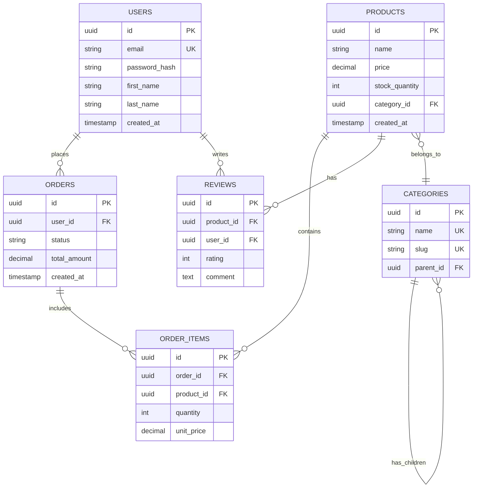

# Database Schema Design

**Categoría:** Backend  
**Nivel:** Intermedio  
**Tecnologías:** PostgreSQL, MySQL, MongoDB

## Objetivo

Diseñar un esquema de base de datos optimizado, normalizado y escalable para un dominio de negocio específico, incluyendo relaciones, índices y constraints.

## Contexto

Este prompt ayuda a crear esquemas de base de datos bien estructurados siguiendo las mejores prácticas de normalización, integridad referencial y performance. Es especialmente útil al iniciar un nuevo proyecto o módulo.

## Prompt

```
Diseña un esquema de base de datos completo para {{domain}} usando {{database_type}}.

Requisitos del esquema:

1. Tablas/Colecciones principales:
   {{list_main_entities}}

2. Para cada tabla/colección incluye:
   - Campos con tipos de datos apropiados
   - Constraints (NOT NULL, UNIQUE, CHECK)
   - Primary keys y Foreign keys
   - Índices para optimizar queries comunes
   - Campos de auditoría (created_at, updated_at)
   - Soft delete (deleted_at) cuando sea apropiado

3. Relaciones entre entidades:
   - Identifica relaciones 1:1, 1:N, N:M
   - Implementa foreign keys apropiadas
   - Define ON DELETE y ON UPDATE behaviors
   - Crea tablas de unión para relaciones N:M

4. Optimización:
   - Índices compuestos para queries frecuentes
   - Índices parciales cuando sea apropiado
   - Considera particionamiento para tablas grandes
   - Define índices UNIQUE para campos que lo requieran

5. Seguridad y validación:
   - Constraints de validación en DB
   - Políticas de encriptación para datos sensibles
   - Row Level Security si aplica

6. Genera:
   - Script SQL de creación de tablas
   - Diagrama ER en formato Mermaid
   - Documentación de cada tabla y campo
   - Índices recomendados con justificación
   - Script de migración inicial

7. Considera:
   - Escalabilidad futura
   - Normalización hasta 3NF (salvo casos justificados)
   - Performance vs normalización
   - Requerimientos de consultas comunes
```

## Ejemplo de Uso

### Variables a reemplazar:

- `{{domain}}`: "E-commerce platform"
- `{{database_type}}`: "PostgreSQL"
- `{{list_main_entities}}`: "Users, Products, Categories, Orders, Order Items, Reviews, Shopping Carts"

### Prompt adaptado:

```
Diseña un esquema de base de datos completo para E-commerce platform usando PostgreSQL.

Requisitos del esquema:

1. Tablas principales:
   Users, Products, Categories, Orders, Order Items, Reviews, Shopping Carts

[... resto del prompt ...]
```

## Resultados Esperados

### 1. Script SQL de Creación

```sql
-- Users table
CREATE TABLE users (
    id UUID PRIMARY KEY DEFAULT gen_random_uuid(),
    email VARCHAR(255) NOT NULL UNIQUE,
    password_hash VARCHAR(255) NOT NULL,
    first_name VARCHAR(100) NOT NULL,
    last_name VARCHAR(100) NOT NULL,
    phone VARCHAR(20),
    email_verified BOOLEAN DEFAULT FALSE,
    created_at TIMESTAMP DEFAULT CURRENT_TIMESTAMP,
    updated_at TIMESTAMP DEFAULT CURRENT_TIMESTAMP,
    deleted_at TIMESTAMP
);

-- Indexes for users
CREATE INDEX idx_users_email ON users(email) WHERE deleted_at IS NULL;
CREATE INDEX idx_users_created_at ON users(created_at);

-- Products table
CREATE TABLE products (
    id UUID PRIMARY KEY DEFAULT gen_random_uuid(),
    name VARCHAR(255) NOT NULL,
    description TEXT,
    price DECIMAL(10, 2) NOT NULL CHECK (price >= 0),
    stock_quantity INTEGER NOT NULL DEFAULT 0 CHECK (stock_quantity >= 0),
    category_id UUID NOT NULL REFERENCES categories(id) ON DELETE RESTRICT,
    sku VARCHAR(100) UNIQUE,
    is_active BOOLEAN DEFAULT TRUE,
    created_at TIMESTAMP DEFAULT CURRENT_TIMESTAMP,
    updated_at TIMESTAMP DEFAULT CURRENT_TIMESTAMP,
    deleted_at TIMESTAMP
);

-- Indexes for products
CREATE INDEX idx_products_category ON products(category_id);
CREATE INDEX idx_products_active ON products(is_active) WHERE deleted_at IS NULL;
CREATE INDEX idx_products_price ON products(price);
CREATE INDEX idx_products_name_search ON products USING gin(to_tsvector('english', name));

-- Categories table
CREATE TABLE categories (
    id UUID PRIMARY KEY DEFAULT gen_random_uuid(),
    name VARCHAR(100) NOT NULL UNIQUE,
    slug VARCHAR(100) NOT NULL UNIQUE,
    parent_id UUID REFERENCES categories(id) ON DELETE CASCADE,
    description TEXT,
    is_active BOOLEAN DEFAULT TRUE,
    created_at TIMESTAMP DEFAULT CURRENT_TIMESTAMP,
    updated_at TIMESTAMP DEFAULT CURRENT_TIMESTAMP
);

-- Orders table
CREATE TABLE orders (
    id UUID PRIMARY KEY DEFAULT gen_random_uuid(),
    user_id UUID NOT NULL REFERENCES users(id) ON DELETE RESTRICT,
    status VARCHAR(50) NOT NULL DEFAULT 'pending',
    total_amount DECIMAL(10, 2) NOT NULL CHECK (total_amount >= 0),
    shipping_address JSONB NOT NULL,
    billing_address JSONB NOT NULL,
    payment_method VARCHAR(50),
    payment_status VARCHAR(50) DEFAULT 'pending',
    notes TEXT,
    created_at TIMESTAMP DEFAULT CURRENT_TIMESTAMP,
    updated_at TIMESTAMP DEFAULT CURRENT_TIMESTAMP
);

-- Indexes for orders
CREATE INDEX idx_orders_user ON orders(user_id);
CREATE INDEX idx_orders_status ON orders(status);
CREATE INDEX idx_orders_created_at ON orders(created_at DESC);
CREATE INDEX idx_orders_user_status ON orders(user_id, status);

-- Order items table
CREATE TABLE order_items (
    id UUID PRIMARY KEY DEFAULT gen_random_uuid(),
    order_id UUID NOT NULL REFERENCES orders(id) ON DELETE CASCADE,
    product_id UUID NOT NULL REFERENCES products(id) ON DELETE RESTRICT,
    quantity INTEGER NOT NULL CHECK (quantity > 0),
    unit_price DECIMAL(10, 2) NOT NULL CHECK (unit_price >= 0),
    total_price DECIMAL(10, 2) NOT NULL CHECK (total_price >= 0),
    created_at TIMESTAMP DEFAULT CURRENT_TIMESTAMP
);

-- Indexes for order items
CREATE INDEX idx_order_items_order ON order_items(order_id);
CREATE INDEX idx_order_items_product ON order_items(product_id);

-- Reviews table
CREATE TABLE reviews (
    id UUID PRIMARY KEY DEFAULT gen_random_uuid(),
    product_id UUID NOT NULL REFERENCES products(id) ON DELETE CASCADE,
    user_id UUID NOT NULL REFERENCES users(id) ON DELETE CASCADE,
    rating INTEGER NOT NULL CHECK (rating BETWEEN 1 AND 5),
    title VARCHAR(200),
    comment TEXT,
    is_verified_purchase BOOLEAN DEFAULT FALSE,
    created_at TIMESTAMP DEFAULT CURRENT_TIMESTAMP,
    updated_at TIMESTAMP DEFAULT CURRENT_TIMESTAMP,
    UNIQUE(product_id, user_id)
);

-- Indexes for reviews
CREATE INDEX idx_reviews_product ON reviews(product_id);
CREATE INDEX idx_reviews_user ON reviews(user_id);
CREATE INDEX idx_reviews_rating ON reviews(rating);

-- Update triggers
CREATE OR REPLACE FUNCTION update_updated_at_column()
RETURNS TRIGGER AS $$
BEGIN
    NEW.updated_at = CURRENT_TIMESTAMP;
    RETURN NEW;
END;
$$ language 'plpgsql';

CREATE TRIGGER update_users_updated_at BEFORE UPDATE ON users
    FOR EACH ROW EXECUTE FUNCTION update_updated_at_column();

CREATE TRIGGER update_products_updated_at BEFORE UPDATE ON products
    FOR EACH ROW EXECUTE FUNCTION update_updated_at_column();

CREATE TRIGGER update_orders_updated_at BEFORE UPDATE ON orders
    FOR EACH ROW EXECUTE FUNCTION update_updated_at_column();
```

### 2. Diagrama ER (Mermaid)



### 3. Documentación

Tabla detallada de cada entidad con descripción de campos, tipos, constraints e índices.

## Tips Adicionales

### Optimizaciones específicas:

1. **Para alta concurrencia:**
   ```
   Agrega optimistic locking usando version fields en tablas críticas.
   Implementa row-level locking para operaciones sensibles.
   ```

2. **Para búsqueda full-text:**
   ```
   Agrega índices GIN para búsqueda de texto en campos {{fields}}.
   Implementa triggers para actualizar vectores de búsqueda.
   ```

3. **Para auditoría completa:**
   ```
   Implementa tabla de auditoría con triggers para rastrear todos los cambios.
   Incluye: user_id, action, old_values, new_values, timestamp.
   ```

4. **Para multi-tenancy:**
   ```
   Agrega tenant_id a todas las tablas y row-level security policies.
   Crea índices compuestos incluyendo tenant_id.
   ```

## Casos de Uso

- ✅ E-commerce platforms
- ✅ SaaS applications
- ✅ Social networks
- ✅ Content management systems
- ✅ Financial applications
- ✅ Healthcare systems

## Tecnologías Compatibles

- **SQL:** PostgreSQL, MySQL, SQL Server, Oracle
- **NoSQL:** MongoDB, DynamoDB (requiere adaptación)

---

_Database Schema Design - Construyendo bases de datos sólidas_ 🗄️
