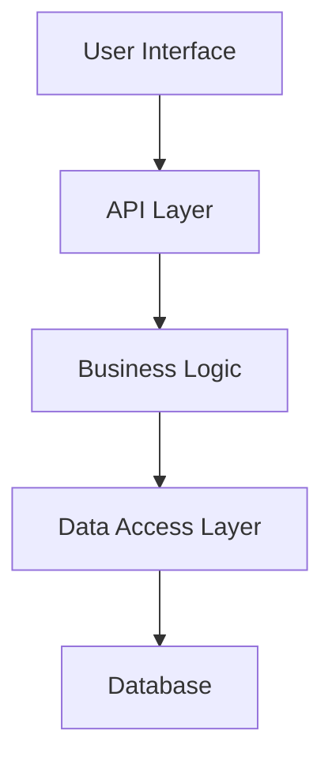
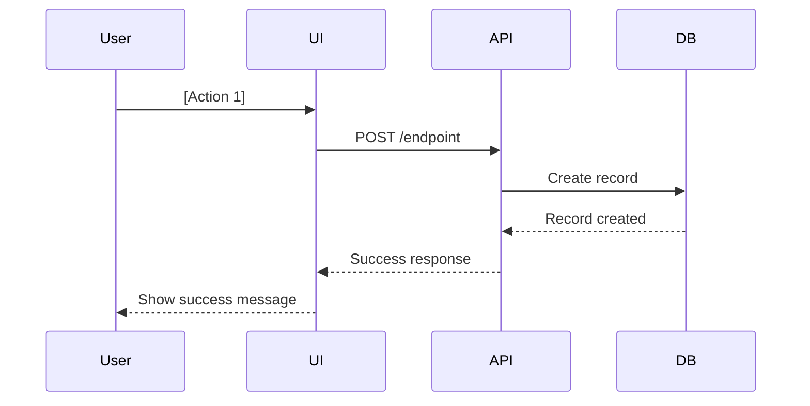

# [Feature Name]

## 📋 Overview

**Feature ID**: [FEAT-XXX]  
**Status**: [Draft | In Development | In Review | Completed]  
**Version**: [x.y.z]  
**Last Updated**: [YYYY-MM-DD]  
**Owner**: [@github-username]

### Description

[2-3 paragraphs describing what this feature does, why it's needed, and what problem it solves]

### User Story

**As a** [type of user]  
**I want** [functionality]  
**So that** [benefit/value]

## 🎯 Goals & Objectives

### Primary Goals

- [Goal 1]: [Description and success criteria]
- [Goal 2]: [Description and success criteria]
- [Goal 3]: [Description and success criteria]

### Success Metrics

| Metric | Target | Current | Status |
|--------|--------|---------|--------|
| [Metric 1] | [Target value] | [Current value] | 🟢/🟡/🔴 |
| [Metric 2] | [Target value] | [Current value] | 🟢/🟡/🔴 |
| [Metric 3] | [Target value] | [Current value] | 🟢/🟡/🔴 |

## 📐 Technical Design

### Architecture Overview



### Components

#### Component 1: [Name]

**Location**: `src/[path]/[component-name]`  
**Responsibility**: [What this component does]

**Key Functions**:
- `[functionName]()`: [Description]
- `[functionName]()`: [Description]

#### Component 2: [Name]

**Location**: `src/[path]/[component-name]`  
**Responsibility**: [What this component does]

**Key Functions**:
- `[functionName]()`: [Description]
- `[functionName]()`: [Description]

### Data Models

#### [ModelName] Entity

```typescript
interface [ModelName] {
  id: string;
  [field1]: [type];
  [field2]: [type];
  createdAt: Date;
  updatedAt: Date;
}
```

**Relationships**:
- Belongs to: [RelatedModel]
- Has many: [RelatedModel]

#### Database Schema

```sql
CREATE TABLE [table_name] (
  id UUID PRIMARY KEY DEFAULT uuid_generate_v4(),
  [field1] [TYPE] NOT NULL,
  [field2] [TYPE],
  created_at TIMESTAMP DEFAULT NOW(),
  updated_at TIMESTAMP DEFAULT NOW()
);
```

### API Endpoints

#### Create [Resource]

```http
POST /api/v1/[resource]
Content-Type: application/json
Authorization: Bearer {token}

{
  "[field1]": "value",
  "[field2]": "value"
}
```

**Response**: `201 Created`

```json
{
  "id": "uuid",
  "[field1]": "value",
  "[field2]": "value",
  "createdAt": "2024-01-01T00:00:00Z"
}
```

#### Get [Resource]

```http
GET /api/v1/[resource]/:id
Authorization: Bearer {token}
```

**Response**: `200 OK`

```json
{
  "id": "uuid",
  "[field1]": "value",
  "[field2]": "value"
}
```

For complete API documentation, see [API Reference](../api/endpoints/[resource].md).

## 🔄 User Flow

### Happy Path



### Alternative Flows

#### Error Handling

1. **Validation Error**
   - User submits invalid data
   - System validates and returns specific errors
   - UI displays error messages
   - User corrects and resubmits

2. **Network Error**
   - Request fails due to network issue
   - System retries with exponential backoff
   - If still failing, show error message
   - User can retry manually

## 💻 Implementation

### File Structure

```
src/
├── features/
│   └── [feature-name]/
│       ├── components/
│       │   ├── [Component1].tsx
│       │   └── [Component2].tsx
│       ├── hooks/
│       │   └── use[FeatureName].ts
│       ├── services/
│       │   └── [feature-name].service.ts
│       ├── types/
│       │   └── [feature-name].types.ts
│       └── utils/
│           └── [feature-name].utils.ts
```

### Code Examples

#### Frontend Component

```typescript
import React from 'react';
import { use[FeatureName] } from './hooks/use[FeatureName]';

export const [ComponentName]: React.FC = () => {
  const { data, loading, error, [action] } = use[FeatureName]();

  if (loading) return <Loading />;
  if (error) return <Error message={error.message} />;

  return (
    <div>
      {/* Implementation */}
    </div>
  );
};
```

#### Backend Service

```typescript
import { Injectable } from '@nestjs/common';
import { [ResourceRepository] } from './repositories/[resource].repository';
import { Create[Resource]Dto } from './dto/create-[resource].dto';

@Injectable()
export class [Resource]Service {
  constructor(
    private readonly repository: [ResourceRepository],
  ) {}

  async create(dto: Create[Resource]Dto) {
    // Validate
    this.validate(dto);
    
    // Create
    const resource = await this.repository.create(dto);
    
    // Return
    return resource;
  }
}
```

## 🧪 Testing Strategy

### Test Coverage Requirements

- **Unit Tests**: > 80% coverage
- **Integration Tests**: All critical paths
- **E2E Tests**: Happy path and major error scenarios

### Unit Tests

```typescript
import { describe, it, expect } from '@jest/globals';
import { [FunctionName] } from './[module]';

describe('[FunctionName]', () => {
  it('should [expected behavior]', () => {
    // Arrange
    const input = [test data];
    
    // Act
    const result = [FunctionName](input);
    
    // Assert
    expect(result).toBe([expected]);
  });

  it('should handle errors when [error condition]', () => {
    // Test error handling
  });
});
```

### Integration Tests

```typescript
import request from 'supertest';
import { app } from './app';

describe('POST /api/v1/[resource]', () => {
  it('should create new [resource]', async () => {
    const response = await request(app)
      .post('/api/v1/[resource]')
      .send({ [field]: 'value' })
      .expect(201);

    expect(response.body).toHaveProperty('id');
    expect(response.body.[field]).toBe('value');
  });
});
```

### E2E Tests

```typescript
import { test, expect } from '@playwright/test';

test('[feature] flow', async ({ page }) => {
  await page.goto('/[route]');
  
  // Perform actions
  await page.fill('[selector]', 'value');
  await page.click('[button-selector]');
  
  // Assert results
  await expect(page.locator('[result-selector]')).toBeVisible();
});
```

## 🔐 Security Considerations

### Authentication & Authorization

- [x] Requires authentication: [Yes/No]
- [x] Role-based access control: [Roles required]
- [x] Rate limiting: [Limits defined]
- [x] Input validation: [Validation rules]

### Data Protection

- [x] Sensitive data encryption: [Fields encrypted]
- [x] PII handling: [How PII is handled]
- [x] Audit logging: [What is logged]
- [x] GDPR compliance: [Compliance measures]

### Security Checklist

- [ ] SQL Injection prevention
- [ ] XSS prevention
- [ ] CSRF protection
- [ ] Input sanitization
- [ ] Output encoding
- [ ] Secure headers
- [ ] Rate limiting
- [ ] Authentication required
- [ ] Authorization checks
- [ ] Audit logging

## 📊 Performance Considerations

### Performance Requirements

| Metric | Target | Measurement Method |
|--------|--------|-------------------|
| API Response Time | < 200ms | Server metrics |
| Page Load Time | < 2s | Lighthouse |
| Time to Interactive | < 3s | Lighthouse |
| Database Query Time | < 50ms | Query profiling |

### Optimization Strategies

- **Caching**: [What is cached and for how long]
- **Database Indexing**: [Indexes created]
- **Lazy Loading**: [What is lazy loaded]
- **Code Splitting**: [Split points]
- **CDN Usage**: [Static assets on CDN]

### Load Testing

```bash
# Load test command
npm run test:load -- --users 100 --duration 60s
```

Expected to handle:
- [X] concurrent users
- [Y] requests per second
- [Z] peak load scenarios

## 🚀 Deployment

### Deployment Checklist

- [ ] Feature flag configured
- [ ] Environment variables set
- [ ] Database migrations prepared
- [ ] Cache invalidation strategy
- [ ] Monitoring alerts configured
- [ ] Rollback plan documented
- [ ] Documentation updated
- [ ] Team notified

### Feature Flags

```typescript
const isFeatureEnabled = featureFlags.isEnabled('[feature-name]', {
  userId: user.id,
  environment: process.env.NODE_ENV,
});
```

**Rollout Strategy**:
1. Enable for internal users (1%)
2. Enable for beta users (10%)
3. Gradual rollout (25% -> 50% -> 100%)

### Monitoring

**Key Metrics to Monitor**:
- Request success/failure rate
- Response times (p50, p95, p99)
- Error rates by type
- User adoption rate
- Feature usage metrics

**Alerts**:
- Error rate > 1%
- Response time p95 > 500ms
- Deployment rollback triggered

## 📝 Documentation

### User Documentation

- [ ] User guide created
- [ ] Help articles written
- [ ] Video tutorial recorded (if applicable)
- [ ] FAQ section updated

### Developer Documentation

- [ ] API documentation updated
- [ ] Code comments added
- [ ] Architecture diagram updated
- [ ] Migration guide written (if breaking changes)

## ✅ Acceptance Criteria

### Functional Requirements

- [ ] [Requirement 1]: Users can [action]
- [ ] [Requirement 2]: System validates [data]
- [ ] [Requirement 3]: Feature handles [scenario]
- [ ] [Requirement 4]: Integration with [system] works

### Non-Functional Requirements

- [ ] Performance: Meets performance targets
- [ ] Security: Passes security review
- [ ] Accessibility: WCAG 2.1 AA compliant
- [ ] Mobile: Works on mobile devices
- [ ] Browser Support: Works on [browsers]

### Quality Criteria

- [ ] Code review approved
- [ ] All tests passing
- [ ] Coverage > 80%
- [ ] No critical bugs
- [ ] Documentation complete
- [ ] Security scan passed
- [ ] Performance benchmarks met

## 🐛 Known Issues & Limitations

### Current Limitations

- **[Limitation 1]**: [Description and workaround]
- **[Limitation 2]**: [Description and workaround]

### Future Improvements

- [ ] [Enhancement 1]: [Description]
- [ ] [Enhancement 2]: [Description]
- [ ] [Enhancement 3]: [Description]

## 📚 References

### Related Features

- [Related Feature 1](./feature-1.md)
- [Related Feature 2](./feature-2.md)

### External Resources

- [Technology Documentation](https://example.com)
- [Design Spec](https://figma.com/[link])
- [Research/Discussion](https://github.com/org/repo/discussions/[id])

### Decision Records

- [ADR-001: Technology Choice](../architecture/decisions/0001-tech-choice.md)
- [ADR-002: Architecture Decision](../architecture/decisions/0002-architecture.md)

## 📅 Timeline

| Phase | Start Date | End Date | Status |
|-------|-----------|----------|--------|
| Design | YYYY-MM-DD | YYYY-MM-DD | ✅ Complete |
| Development | YYYY-MM-DD | YYYY-MM-DD | 🔄 In Progress |
| Testing | YYYY-MM-DD | YYYY-MM-DD | ⏳ Pending |
| Deployment | YYYY-MM-DD | YYYY-MM-DD | ⏳ Pending |

## 🤝 Contributors

- **[Name]** - *Lead Developer* - [@github-username]
- **[Name]** - *Designer* - [@github-username]
- **[Name]** - *QA* - [@github-username]

## 📝 Changelog

### [Version x.y.z] - YYYY-MM-DD

#### Added
- [New functionality]

#### Changed
- [Changes to existing functionality]

#### Fixed
- [Bug fixes]

---

_Last updated: [YYYY-MM-DD] by [@github-username]_
